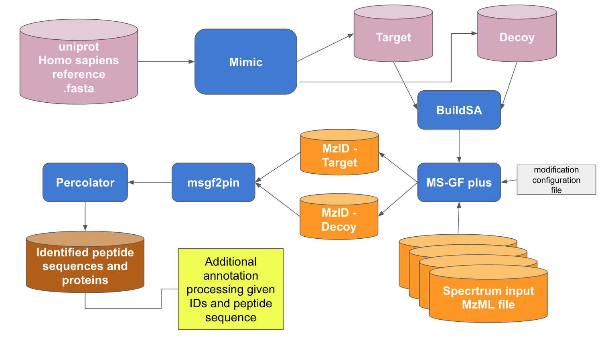

# Peptides SpecTra Annotations (PaSTA)

## Background
Unlike the genomics field, currently most tools/workflows for analyzing proteomics data are either tied to a specific platform, such as Galaxy, or an operating system (OS), such as Microsoft 
Windows or Linux.  This lack of publicly available, non-platform/OS-dependent and reusable proteomics tools and workflows is preventing valuable public proteomic datasets, such as those in 
NCI’s [Proteomic Data Commons](), to be analyzed.  This proposal is to create an analysis workflow to generate annotated peptide sequence from proteomic spectra using containerized tools.


## Challenges in the field

TBD

## Workflow


## Prerequisite

- Java
- Cmake

## Installation

### Download the git repo

``` shell
git clone https://github.com/NCBI-Hackathons/Peptides-SpecTra-Annotations-PaSTA
cd Peptides-SpecTra-Annotations-PaSTA
```

### Download the dataset used

``` shell
wget --recursive --no-parent --reject="index.html*" -e robots=off https://cptc-xfer.uis.georgetown.edu/publicData/Phase_II_Data/TCGA_Colorectal_Cancer_S_022/TCGA-A6-3807-01A-22_Proteome_VU_20121019/TCGA-A6-3807-01A-22_Proteome_VU_20121019_mzML/
gzip -d cptc-xfer.uis.georgetown.edu/publicData/Phase_II_Data/TCGA_Colorectal_Cancer_S_022/TCGA-A6-3807-01A-22_Proteome_VU_20121019/TCGA-A6-3807-01A-22_Proteome_VU_20121019_mzML/TCGA-A6-3807-01A-22_W_VU_201210*.mzML.gz
```

### Install MSGFPlus

``` shell
wget https://github.com/MSGFPlus/msgfplus/releases/download/v2018.07.17/v2018.07.17.zip
mkdir -p software/MSGFPlus
unzip -d software/MSGFPlus v2018.07.17.zip
rm v2018.07.17.zip
```

### Install Percolator

``` shell
wget https://github.com/percolator/percolator/releases/download/rel-3-02-01/ubuntu64.tar.gz`
tar -xvzf ubuntu64.tar.gz
sudo dpkg -i *.deb
sudo apt-get install -f
```

### Installl Mimic

``` shell
wget https://github.com/percolator/mimic/archive/rel-1-00.zi
unzip rel-1-00.zip
cd mimic-rel-1-00
cmake -DCMAKE_INSTALL_PREFIX=$(pwd)/../software/ src/ && make && make install
cd ..
rm -rf mimic-rel-1-00 rel-1-00.zip
```

## Run the whole pipeline

`bash examples/workflow_mimic_msgf_percolator.sh`

## Docker Instructions (under development)

A Docker image for the tools in the workflow is avialable here.  The image includes all the prerequisites and dependencies.  
To run the Docker image - 

Docker stuff goes here...

## Presentations

- [Day 1](https://docs.google.com/presentation/d/147Zc5lRd3Z88NPPw3sXfVm7SiB_dCZIF6JZnVzG_pJU/edit?usp=sharing)
- [Day 2](https://docs.google.com/presentation/d/1ND4Cnr6sN9k4f0hoWJ7APOw7Lo6x2yM-hDTkRCNlyWo/edit?usp=sharing)

## Resources

- Information of dastset used in the example [https://cptac-data-portal.georgetown.edu/cptac/s/S022](https://cptac-data-portal.georgetown.edu/cptac/s/S022).
- [MS-GF+](https://htmlpreview.github.io/?https://github.com/MSGFPlus/msgfplus/blob/master/doc/index.html): GitHub repo HTML help pages
- [Percolator](http://percolator.ms): Semi-supervised learning for peptide identification from shotgun proteomics datasets.
- [Mimic](https://github.com/percolator/mimic): Mimic shuffles peptides in a manner that conserves homolog peptides. 

## Future development

- Downstream analysis: http://meme-suite.org/
- Run the whole pipeline in a Docker image
